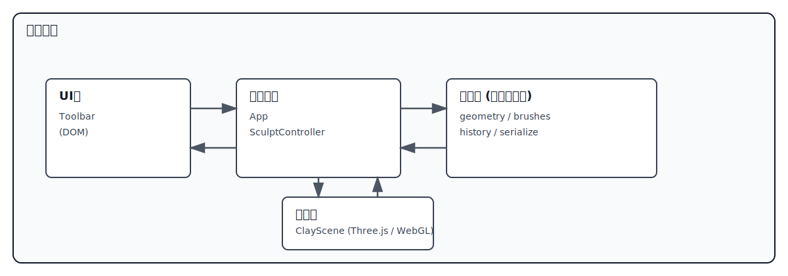
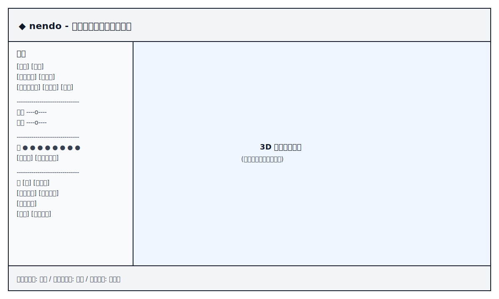
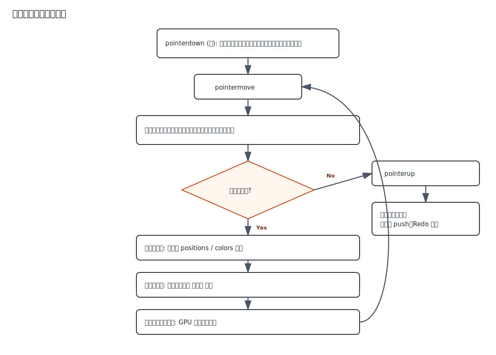
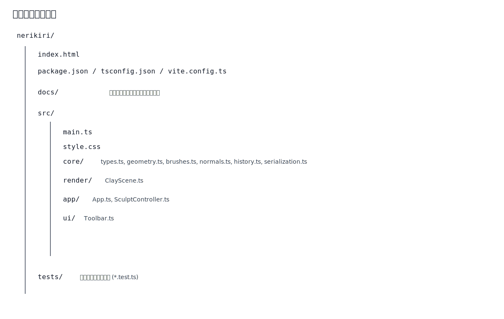

# 基本設計書

**プロジェクト名**: 粘土細工シミュレーション Webアプリケーション「nendo」
**作成日**: 2026-07-05
**版数**: 1.2
**関連文書**: 02_requirements-definition.md

**改訂履歴**

| 版数 | 日付 | 内容 |
|---|---|---|
| 1.0 | 2026-07-05 | 初版 |
| 1.1 | 2026-07-05 | 初期形状プリセットを「球・基本形」の2種に変更(F-01-03改訂)。作業台グリッド・正面マーカー・高さ目盛りをシーン構成に追加(F-01-04) |
| 1.2 | 2026-07-05 | 道具「三角棒」(線分彫りエンジン groove.ts)を追加(F-03-12)。点ブラシとは別方式(軌跡の線分に沿ったV字彫り+手ぶれ補正) |

---

## 1. システム構成

### 1.1 全体構成

サーバーレスのシングルページアプリケーション。ビルド後は静的ファイル(HTML/JS/CSS)のみで構成される(NF-04)。



編集元: [diagrams/system-architecture.drawio](diagrams/system-architecture.drawio)

### 1.2 技術選定

| 項目 | 採用技術 | 選定理由 |
|---|---|---|
| 言語 | TypeScript 5 | 型安全性による保守性向上(NF-06) |
| 3D描画 | Three.js | WebGLの事実上標準ライブラリ。レイキャスト・カメラ制御が充実 |
| ビルド | Vite 5 | 高速な開発サーバー、静的ビルド出力(NF-04) |
| 単体テスト | Vitest | Vite統合。コア層はDOM/WebGL非依存のためNode環境でテスト可能(NF-06) |
| UI | 素のDOM + CSS | 依存最小化、バンドルサイズ抑制(NF-02) |

### 1.3 レイヤー構成と依存方向

依存は「UI層・描画層 → アプリ層 → コア層」の一方向とする。**コア層はThree.js・DOMに依存しない**(NF-06)。

| 層 | ディレクトリ | 責務 | 依存 |
|---|---|---|---|
| コア層 | `src/core/` | メッシュデータ生成、ブラシ変形演算、法線再計算、履歴、直列化 | なし(純TypeScript) |
| 描画層 | `src/render/` | Three.jsシーン管理、コアデータとGPUバッファの同期、ブラシカーソル表示 | Three.js, コア層 |
| アプリ層 | `src/app/` | 入力処理(ポインタ→レイキャスト→ブラシ適用)、状態管理、各層の結線 | コア層, 描画層 |
| UI層 | `src/ui/` | ツールパネルDOM生成、イベント通知 | なし(コールバックでアプリ層へ通知) |

## 2. モジュール構成

| モジュール | ファイル | 概要 | 対応要件 |
|---|---|---|---|
| 型定義 | `src/core/types.ts` | `ClayMeshData`、ブラシ種別等の共通型 | - |
| 形状生成 | `src/core/geometry.ts` | イコスフィア生成、初期形状プリセット(球/まんじゅう/俵) | F-01-01, F-01-03 |
| ブラシ演算 | src/core/brushes.ts | 点ブラシ7種(押す/引く/なめらか/つまむ/ふくらます/ならす/塗る)の頂点変形・彩色、フォールオフ | F-03-*, F-04-01 |
| 三角棒 | src/core/groove.ts | 手ぶれ補正済みの軌跡を線分としてV字断面で彫る線引きエンジン。1ストローク内の彫り深さを管理 | F-03-12 |
| 法線計算 | `src/core/normals.ts` | 変形後の頂点法線再計算 | F-01-02 |
| 履歴管理 | `src/core/history.ts` | スナップショット方式のUndo/Redo | F-05-* |
| 直列化 | `src/core/serialization.ts` | 形状・色のJSON化と復元、バリデーション | F-06-02〜04 |
| シーン描画 | `src/render/ClayScene.ts` | シーン・ライト・粘土メッシュ・カーソルリング、作業台グリッド・正面マーカー・高さ目盛り、カメラ操作(OrbitControls) | F-01-02, F-01-04, F-02-*, F-03-11 |
| 操作制御 | `src/app/SculptController.ts` | ポインタイベント→レイキャスト→ブラシ適用→ストローク確定 | F-03-01, F-05-01 |
| 統合 | `src/app/App.ts` | 全体の状態(選択ツール・色・ブラシ設定)と各層の結線、リセット/保存/読込 | F-06-*, F-07-* |
| ツールUI | `src/ui/Toolbar.ts` | ツールパネル・スライダー・パレットのDOM構築 | F-07-*, F-03-08/09, F-04-03/04 |
| エントリ | `src/main.ts` | 起動処理 | - |

## 3. 画面設計

### 3.1 画面レイアウト(1画面構成)



編集元: [diagrams/screen-layout.drawio](diagrams/screen-layout.drawio)

### 3.2 操作体系

| 入力 | 動作 | 対応要件 |
|---|---|---|
| 左ボタンドラッグ(粘土上) | 選択中ブラシの適用(ストローク) | F-03-01 |
| 右ボタンドラッグ | カメラ回転 | F-02-01 |
| ホイール | ズーム | F-02-02 |
| Ctrl+Z / Ctrl+Y / Ctrl+Shift+Z | Undo / Redo | F-05-04 |
| ポインタ移動(粘土上) | ブラシ範囲リング表示 | F-03-11 |

カメラ操作は右ボタン・ホイールのみに割り当て、左ボタンはスカルプト専用とすることで誤変形を防ぐ(F-02-03)。

## 4. データ設計

### 4.1 粘土メッシュデータ(コア層の中心データ構造)

```ts
interface ClayMeshData {
  positions: Float32Array;  // 頂点座標 (x,y,z) × 頂点数
  normals:   Float32Array;  // 頂点法線 (x,y,z) × 頂点数
  colors:    Float32Array;  // 頂点色 (r,g,b) × 頂点数、各0..1
  indices:   Uint32Array;   // 三角形インデックス
}
```

- 初期形状: イコスフィア細分化レベル5(頂点10,242 / 三角形20,480)を基準とし、性能要件(NF-01: 約1万頂点)を満たす。頂点間隔(約0.033)は最小ブラシ半径(0.03)と同程度で、三角棒の線引きが点線にならない解像度である。
- プリセットは「球」(半径1)と「基本形」(球に練り切りプロファイル: 上面平ら・下すぼみ を適用)の2種。いずれも底面が y=-1 となり作業台に接する。
- トポロジー(indices)は生成後不変。変形は positions のみ、彩色は colors のみを書き換える(スコープ外事項に整合)。

### 4.2 履歴データ

- スナップショット方式: ストローク確定時に `positions` と `colors` のコピーを保存。
- 最大保持数 50(F-05-03 の30以上を満たす)。超過時は最古を破棄。

### 4.3 保存ファイル形式(JSON)

```json
{
  "format": "nendo-clay",
  "version": 1,
  "shape": "sphere",
  "positions": [ ... ],
  "colors": [ ... ],
  "indices": [ ... ]
}
```

- `format`/`version` で自ファイル判定を行い、不一致・欠損・数値配列長の不整合はエラーとする(F-06-04)。
- 法線は保存せず、読込時に再計算する(ファイルサイズ削減)。

## 5. 処理方式設計

### 5.1 スカルプト処理フロー



編集元: [diagrams/sculpt-flow.drawio](diagrams/sculpt-flow.drawio)

### 5.2 ブラシ共通方式

- 影響範囲: ヒット点から半径 r 以内の頂点。
- フォールオフ: `w = smoothstep(1 - d/r)`(中心1、外縁0)(F-03-10)。
- 各点ブラシは `(mesh, hit, params) => 変更頂点集合` の共通インタフェース(NF-07)。三角棒のみ例外で、ストローク状態(彫り済み深さ)を持つ線分彫り方式(groove.ts)とする。

### 5.3 性能方式

- ブラシ適用は TypedArray の直接操作で行い、オブジェクト生成を避ける。
- GPUへの反映は `BufferAttribute.needsUpdate` による一括更新。
- 法線再計算は面法線加算方式 O(三角形数)。基準メッシュ(5,120三角形)では1ストローク中の毎フレーム実行でも性能要件内。

## 6. エラー処理方針

| 事象 | 処理 |
|---|---|
| WebGL初期化失敗 | 画面にエラーメッセージを表示(操作不能である旨) |
| 保存ファイル読込失敗(形式不正等) | アラート表示、現状態は維持(F-06-04) |
| Undo/Redo不能時(履歴なし) | ボタンを無効化表示 |

## 7. ディレクトリ構成



編集元: [diagrams/directory-structure.drawio](diagrams/directory-structure.drawio)
